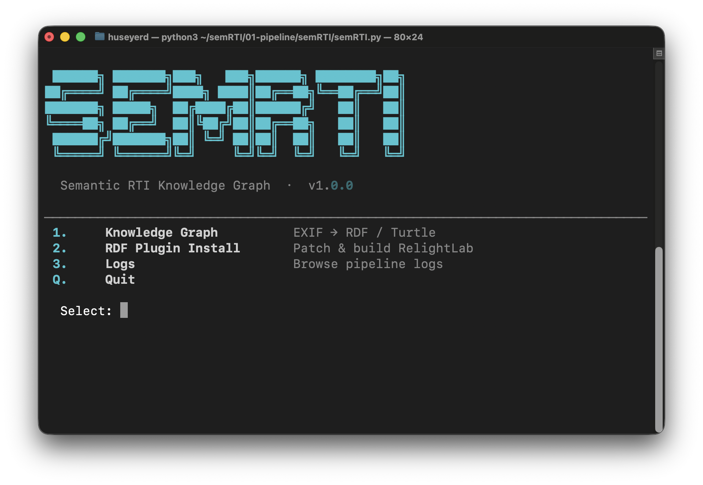

# semRTI — Semantic RTI Knowledge Graph

**Rupe Magna Rock Art Site, Grosio, Italy**

**Author:** Hüseyin Erdoğan · [ORCID 0000-0002-2965-0918](https://orcid.org/0000-0002-2965-0918)  
**Affiliation:** Alma Mater Studiorum – Università di Bologna  
**License:** [CC BY 4.0](https://creativecommons.org/licenses/by/4.0/)  
**Version:** 1.0 · 2026-05-14

---



## Overview

semRTI converts RTI photographic survey data into a **FAIR-compliant RDF/Turtle Knowledge Graph**, aligned to the [Cultural Heritage Survey Ontology Design Pattern](https://github.com/odpa/patterns-repository/blob/master/CulturalHeritageSurvey/index.md) (CHS-ODP).

The graph documents **40 RTI acquisition sessions** across **11 rock art figures** (F01–F11) at the Rupe Magna petroglyph site (Grosio, Lombardy, Italy), September 2025. It covers the complete documentation chain from raw photographic acquisition through RTI model generation, encoding equipment configuration, per-frame observations, provenance, and authorship in a single machine-readable Turtle file.

---

## Requirements

| Tool | Version | Install |
|---|---|---|
| Python | 3.10+ | `brew install python3` |
| Rich | 13.x+ | `pip3 install rich` |
| Java | 11+ | `brew install openjdk` |
| exiftool | any | `brew install exiftool` |
| SPARQL Anything | 1.x | [Download JAR](https://github.com/SPARQL-Anything/sparql.anything/releases/tag/v1.1.0) → place as `sparql-anything.jar` in this directory |

---

## Quick Start

```bash
python3 01-pipeline/semRTI/semRTI.py
```

---

## Files

| File | Purpose |
|---|---|
| `semRTI.py` | CLI entry point (Rich-based menu) |
| `kg-config.json` | Author, site, GPS, and licence metadata |
| `shared.ttl` | Static RDF: project, site, agent, equipment, figures (Sections A + B) |
| `construct-dataset.sparql` | SPARQL CONSTRUCT: per-session resources (Section C) |
| `construct-photos.sparql` | SPARQL CONSTRUCT: per-photo resources (Section D) |
| `dataset-config.csv` | Per-session RTI output references (used by Section E) |
| `rdf-plugin/` | RelightLab RDF export plugin (C++) — Section E |
| `CulturalHeritageSurvey.ttl` | Reference ODP (read-only) |
| `rupemagna-rti-ontology.owl` | Application profile ontology (OWL/XML) |
| `sparql-anything.jar` | SPARQL Anything engine (not versioned — download separately) |

---

## Knowledge Graph Pipeline

The KG is built in six sequential steps:

```
Step 1  EXIF write      exiftool → embed author / GPS / licence into JPEGs
Step 2  EXIF export     exiftool → rupe-magna-exif.json
Step 3  Section C       SPARQL Anything → construct-dataset.sparql
                        → per-session: Survey, EquipmentConfig,
                          ObservationCollection, Dataset, Distributions
Step 4  Section D       SPARQL Anything → construct-photos.sparql
                        → per-photo: Observation, PhotographicDocumentation,
                          Measurements (ISO, f-number, shutter, focal length,
                          file size, image dimensions)
Step 5  Merge           shared.ttl + C + D → rupe-magna-complete.ttl
Step 6  Section E       RelightLab TTL sidecars → merged into final graph
                        → PTM/HSH Distribution with full ODP alignment:
                            · dcat:Distribution + chs:Result  (co-type)
                            · prov:wasGeneratedBy → rm-survey:{sessionID}
                            · dct:created  (processing timestamp, UTC)
                            · Measurements: pixel size · RTI type · colorspace
                              n-planes · quality · colour profile mode
                              OpenLime enabled · crop origin (x, y, angle)
```

**Outputs**

| File | Contents |
|---|---|
| `rupe-magna-exif.json` | Raw EXIF export for all sessions |
| `rupe-magna-complete.ttl` | Merged graph: Sections A + B + C + D |
| `rupe-magna-final.ttl` | Final graph: A + B + C + D + E (RTI sidecar triples) |

---

## Ontology Design Pattern — CHS-ODP

This version was rebuilt from scratch to align fully with the **Cultural Heritage Survey ODP** (`CulturalHeritageSurvey.ttl`). No classes or properties from earlier ad-hoc versions are retained.

### ODP Class Hierarchy

```
chs:CulturalHeritageProject
  └─ chs:hasSurvey ──► chs:CulturalHeritageSurvey
        ├─ chs:isSurveyOn ──────────────► chs:CulturalProperty
        ├─ chs:usesEquipmentConfiguration ► chs:EquipmentConfiguration
        │       └─ chs:usesEquipment ──────► chs:Hardware
        └─ chs:hasObservationCollection ──► chs:ObservationCollection
                └─ chs:hasMember ───────────► chs:Observation
                        ├─ chs:hasFeatureOfInterest ► chs:FeatureOfInterest
                        └─ chs:hasResult ───────────► chs:Result
```

### Rupe Magna Instance

```
chs:CulturalHeritageProject          rm-project:rupe-magna-rti
  └─ chs:hasSurvey
       └─ chs:CulturalHeritageSurvey     rm-survey:{sessionID}
             ├─ chs:isSurveyOn ──────────► rm-fig:{figureID}, rm-site:rupe-magna
             ├─ chs:usesEquipmentConfiguration
             │    └─ chs:EquipmentConfiguration   rm-econf:{sessionID}
             │         ├─ chs:usesEquipment ──────► rm-equip:rti-dome
             │         ├─ chs:usesEquipment ──────► rm-equip:fujifilm-xs20
             │         └─ a-dd:hasMeasurementCollection
             │              └─ ISO · aperture · shutter · focal-length
             └─ chs:hasObservationCollection
                  └─ chs:ObservationCollection    rm-ocoll:{sessionID}
                       └─ chs:hasMember (×48)
                            └─ chs:Observation    rm-obs:{basename}
                                 ├─ chs:hasFeatureOfInterest ──► rm-fig:{figureID}
                                 └─ chs:hasResult
                                      ├─ rm-photo:{basename}-jpg  (JPEG export)
                                      └─ rm-photo:{basename}-raw  (RAF — if applicable)
```

**Section E — RTI Distribution chain:**

```
rm-survey:{sessionID}              chs:CulturalHeritageSurvey
  └─ (prov:wasGeneratedBy ◄──────)
       rm-dist:{sessionID}-ptm     dcat:Distribution , chs:Result
            ├─ dct:created         (processing timestamp, UTC ISO 8601)
            ├─ schema:width / schema:height
            ├─ dct:format          (PTM / HSH / Bilinear)
            └─ a-dd:hasMeasurementCollection
                 └─ pixel size · RTI type · colorspace · n-planes · quality
                    colour profile mode · OpenLime enabled · crop origin (x,y,angle)
```

### Key Alignment Bridge

`arco:ArchaeologicalProperty` is used where the ODP expects `chs:CulturalProperty` and `chs:FeatureOfInterest`. Two `rdfs:subClassOf` declarations in `rupemagna-rti-ontology.owl` make this OWL-valid:

```turtle
arco:ArchaeologicalProperty
    rdfs:subClassOf chs:CulturalProperty ;
    rdfs:subClassOf chs:FeatureOfInterest .
```

Without these declarations, OWL reasoners would flag range violations on `chs:isSurveyOn` and `chs:hasFeatureOfInterest`.

---

## Application Profile Ontology (`rupemagna-rti-ontology.owl`)

The OWL file is an application profile — it does not define new classes or properties. It:

- Imports the CHS-ODP and all supporting ontologies (ArCo, DCAT 3, DCT, FOAF, GeoWGS84, MUAPIT, ROAPIT, TIAPIT)
- Declares the `arco:ArchaeologicalProperty` alignment bridge
- Adds OWL cardinality restrictions to document expected counts:
  - `chs:CulturalHeritageSurvey`: exactly 1 `EquipmentConfiguration`, exactly 1 `ObservationCollection`, at least 2 `isSurveyOn` targets, exactly 1 `AgentRole`
  - `chs:EquipmentConfiguration`: exactly 2 `Hardware`, exactly 1 `MeasurementCollection`
  - `chs:ObservationCollection`: exactly 48 `Observation` members
  - `chs:Observation`: exactly 1 `hasFeatureOfInterest`, exactly 2 `hasResult` (JPEG + RAF; JPEG-only sessions have 1)
  - `a-cd:PhotographicDocumentation`: exactly 1 `dct:isPartOf` Distribution
- Profiles all datatype properties with domains and ranges

---

## Knowledge Graph Structure

### Resource Types and URI Patterns

| Class                                      | URI Pattern                          |
| ------------------------------------------ | ------------------------------------ |
| `chs:CulturalHeritageProject`              | `rm-project:rupe-magna-rti`          |
| `arco:ArchaeologicalProperty` (site)       | `rm-site:rupe-magna`                 |
| `arco:ArchaeologicalProperty` (figure)     | `rm-fig:{F01–F11}`                   |
| `dcat:DatasetSeries`                       | `rm-series:{F01–F11}`                |
| `chs:CulturalHeritageSurvey`               | `rm-survey:{sessionID}`              |
| `chs:EquipmentConfiguration`               | `rm-econf:{sessionID}`               |
| `core:AgentRole`                           | `rm-role:{sessionID}-photographer`   |
| `a-dd:MeasurementCollection` (session)     | `rm-mcoll:{sessionID}`               |
| `a-dd:Measurement` (session)               | `rm-meas:{sessionID}-{type}`         |
| `chs:ObservationCollection`                | `rm-ocoll:{sessionID}`               |
| `dcat:Dataset`                             | `rm-data:{sessionID}`                |
| `dcat:Distribution` (JPG)                  | `rm-dist:{sessionID}-jpg`            |
| `dcat:Distribution` (RAW)                  | `rm-dist:{sessionID}-raw`            |
| `dcat:Distribution , chs:Result` (PTM/HSH) | `rm-dist:{sessionID}-ptm` / `-hsh`   |
| `chs:Observation`                          | `rm-obs:{basename}`                  |
| `a-cd:PhotographicDocumentation` (JPG)     | `rm-photo:{basename}-jpg`            |
| `a-cd:PhotographicDocumentation` (RAF)     | `rm-photo:{basename}-raw`            |
| `a-dd:MeasurementCollection` (per image)   | `rm-mcoll:{basename}-jpg/raw`        |
| `a-dd:Measurement` (per image)             | `rm-meas:{basename}-{format}-{type}` |


---

## Static Resources (`shared.ttl`)

### Section A — Site, Agent, Equipment

| Resource | URI | Description |
|---|---|---|
| CulturalHeritageProject | `rm-project:rupe-magna-rti` | Top-level container for all 40 sessions |
| Archaeological site | `rm-site:rupe-magna` | Rupe Magna, Grosio (lat 46.292692, lon 10.264064, alt 679.9 m) |
| Agent | `rm-agent:huseyin-erdogan` | `foaf:Person` + `core:Agent`; ORCID linked |
| RTI Dome | `rm-equip:rti-dome` | Custom 48-LED hemispherical dome, Ø 460 mm, 6 elevation tiers |
| Camera | `rm-equip:fujifilm-xs20` | Fujifilm X-S20 + XF 16–55 mm f/2.8 lens |
| MeasurementTypes | `rm-mtype:{iso,f-number,...}` | 7 types (ISO, f-number, exposure time, focal length, file size, width, height) |
| MeasurementUnits | `rm-unit:{iso-sensitivity,...}` | 6 units |

### Section B — Rock Art Figures (F01–F11)

| Figure | Session(s) | Sector | Name |
|---|---|---|---|
| F01 | RTI-01 – RTI-10 | AA | The Praying Figure with Spiral |
| F02 | RTI-11 – RTI-12 | B | The Praying Woman Figure |
| F03 | RTI-13 – RTI-18 | F | The Spiral Figure |
| F04 | RTI-19 – RTI-23 | L | The Warrior Figure with Shield |
| F05 | RTI-24 | L | The Second Warrior Figure |
| F06 | RTI-25 – RTI-26 | L | The Wild Boar Figure |
| F07 | RTI-27 – RTI-28 | Q | The Goat Figure with a Beard |
| F08 | RTI-29 – RTI-33 | Q | The Second Goat Figure |
| F09 | RTI-34 – RTI-35 | Q | The Map-like Figure |
| F10 | RTI-36 – RTI-38 | S | The Knight Figure |
| F11 | RTI-39 – RTI-40 | S | The Figure with a Square |

----

## SPARQL Construction Strategy

### Section C — `construct-dataset.sparql`

One result row per session. Camera settings (ISO, aperture, shutter speed, focal length) are read from a single representative EXIF record.

### Section D — `construct-photos.sparql`

One result row per JPEG file. The same priority filter applies. All RAW companion resources (`?photoRawURI`, `?mcollRawURI`, measurement URIs, labels) are wrapped in the same `IF(?isExport, ..., ?_undef)` guard.


Supported layouts:

```
02-datasets/Rupe Magna/F01/RTI-09/jpg-export/DSCF1234.jpg
02-datasets/Rupe Magna/F01/RTI-09/jpg-export-linear/DSCF1234.jpg
02-datasets/Rupe Magna/F01/RTI-09/jpg-export-linear-LC/DSCF1234.jpg
02-datasets/Rupe Magna/F05/RTI-24/jpg/DSCF5678.jpg       ← JPEG-only session
```


---

## Section E — RelightLab RDF Plugin

The `rdf-plugin/` directory contains C++ source files for the RelightLab RDF export plugin (`rdfexport.cpp/.h`, `metadataframe.cpp/.h`). When installed into RelightLab via the **RDF Plugin Install** menu option, it generates a `.ttl` sidecar file alongside each RTI output (PTM, HSH, Bilinear). These sidecars are collected into the final graph at Step 6.

### ODP Alignment

The PTM/HSH output is the derived product of 48 survey observations. It is typed as both `dcat:Distribution` (DCAT publication layer) and `chs:Result` (ODP deliverable). `prov:wasGeneratedBy` links it back to the originating Survey without requiring a new property:

```turtle
rm-dist:RTI-26-ptm
    a owl:NamedIndividual , dcat:Distribution , chs:Result ;
    prov:wasGeneratedBy rm-survey:RTI-26 ;
    dct:created "2026-05-08T14:23:00+02:00"^^xsd:dateTime ;
    schema:width 4934 ;
    schema:height 3289 ;
    dct:format "PTM" ;
    a-dd:hasMeasurementCollection rm-mcoll:RTI-26-ptm .
```

### Fields Written to TTL

| Field | Source | TTL predicate / node |
|---|---|---|
| Image dimensions | `info.json` | `schema:width`, `schema:height` |
| Pixel size | `info.json` | `rm-mtype:rti-pixel-size-mm` Measurement |
| RTI type | `info.json` | `rm-mtype:rti-type` Measurement |
| Colorspace | `info.json` | `rm-mtype:rti-colorspace` Measurement |
| N-planes | `info.json` | `rm-mtype:rti-nplanes` Measurement |
| Quality | `info.json` | `rm-mtype:rti-quality` Measurement |
| **Colour profile mode** | `params->colorProfileMode` | `rm-mtype:rti-color-profile-mode` Measurement |
| **OpenLime enabled** | `params->openlime` | `rm-mtype:rti-openlime` Measurement |
| **Crop origin (x, y, angle)** | `project.crop` | `rm-mtype:rti-crop-origin` Measurement |
| **Processing timestamp** | `QDateTime::currentDateTimeUtc()` | `dct:created` on Distribution |
| **ODP co-type** | hard-coded | `a chs:Result` on Distribution |
| **Provenance link** | session metadata | `prov:wasGeneratedBy` on Distribution |

Bold rows were added in v1.0.

### Colour Profile Mode Labels

| `colorProfileMode` value | Label in TTL |
|---|---|
| 0 | `"Linear RGB"` |
| 1 | `"sRGB"` |
| 2 | `"Display P3"` |

### Conditional Output

- **Colour profile mode** — always written (falls back to `"sRGB"` if params unavailable)
- **OpenLime** — always written when params is not null
- **Crop origin** — only written when at least one of `crop.left()`, `crop.top()`, `crop.angle` is non-zero
- **`prov:wasGeneratedBy`** — only written when `sessionId` is non-empty

The plugin must be recompiled after each RelightLab update via the RDF Plugin Install menu.

---

## Supporting Ontologies

| Prefix | Ontology | Used for |
|---|---|---|
| `chs:` | [CulturalHeritageSurvey ODP](http://www.ontologydesignpatterns.org/cp/owl/culturalheritagesurvey.owl) | Core survey classes and properties |
| `arco:` | [ArCo](https://w3id.org/arco/ontology/arco) | `arco:ArchaeologicalProperty` — site and figures |
| `a-cd:` | [ArCo context-description](https://w3id.org/arco/ontology/context-description) | `PhotographicDocumentation`, `PhotoInterpretationRendering` |
| `a-dd:` | [ArCo denotative-description](https://w3id.org/arco/ontology/denotative-description) | `Measurement`, `MeasurementCollection`, `MeasurementType` |
| `core:` | [ArCo core](https://w3id.org/arco/ontology/core) | `AgentRole` |
| `dcat:` | [DCAT 3](https://www.w3.org/TR/vocab-dcat-3/) | `Dataset`, `DatasetSeries`, `Distribution` |
| `dct:` | [Dublin Core Terms](https://www.dublincore.org/specifications/dublin-core/dcmi-terms/) | creator, license, format, created, spatial |
| `foaf:` | [FOAF](http://xmlns.com/foaf/0.1/) | `Person`, `mbox`, `name` |
| `geo:` | [WGS84 Geo](https://www.w3.org/2003/01/geo/) | `lat`, `long`, `alt` |
| `muapit:` | [MUAPIT](https://w3id.org/italia/onto/MU/) | `MeasurementUnit`, `value` |
| `roapit:` | [ROAPIT](https://w3id.org/italia/onto/RO/) | `isRoleOf`, `withRole` |
| `tiapit:` | [TIAPIT](https://w3id.org/italia/onto/TI/) | `startTime`, `endTime` |
| `schema:` | [Schema.org](https://schema.org/) | equipment attributes, location, job title |
| `prov:` | [W3C PROV-O](https://www.w3.org/TR/prov-o/) | `wasGeneratedBy` — Distribution → Survey |

---

## Dataset Coverage

40 RTI sessions across 11 rock art figures (F01–F11), Rupe Magna, Grosio, Italy.  
Acquisition: September 2025. Equipment: custom 48-LED RTI dome (Ø 460 mm) + Fujifilm X-S20.

Sessions support two capture modes:
- **RAW + Fast Forge** (`jpg-export*/`) — produces JPEG + RAF resources in the graph
- **JPEG-only** (`jpg/`, e.g. RTI-24) — produces JPEG resources only; RAF triples omitted via UNDEF guard

---

## Namespace Map

| Prefix | Base URI |
|---|---|
| `rm-project:` | `https://w3id.org/rupemagna/resource/project/` |
| `rm-survey:` | `https://w3id.org/rupemagna/resource/survey/` |
| `rm-ocoll:` | `https://w3id.org/rupemagna/resource/observation-collection/` |
| `rm-obs:` | `https://w3id.org/rupemagna/resource/observation/` |
| `rm-photo:` | `https://w3id.org/rupemagna/resource/photo/` |
| `rm-fig:` | `https://w3id.org/rupemagna/resource/figure/` |
| `rm-site:` | `https://w3id.org/rupemagna/resource/site/` |
| `rm-agent:` | `https://w3id.org/rupemagna/resource/agent/` |
| `rm-equip:` | `https://w3id.org/rupemagna/resource/equipment/` |
| `rm-econf:` | `https://w3id.org/rupemagna/resource/equipment-config/` |
| `rm-data:` | `https://w3id.org/rupemagna/resource/dataset/` |
| `rm-dist:` | `https://w3id.org/rupemagna/resource/distribution/` |
| `rm-series:` | `https://w3id.org/rupemagna/resource/dataset-series/` |
| `rm-mcoll:` | `https://w3id.org/rupemagna/resource/measurement-collection/` |
| `rm-meas:` | `https://w3id.org/rupemagna/resource/measurement/` |
| `rm-mtype:` | `https://w3id.org/rupemagna/resource/measurement-type/` |
| `rm-unit:` | `https://w3id.org/rupemagna/resource/unit/` |
| `prov:` | `http://www.w3.org/ns/prov#` |
